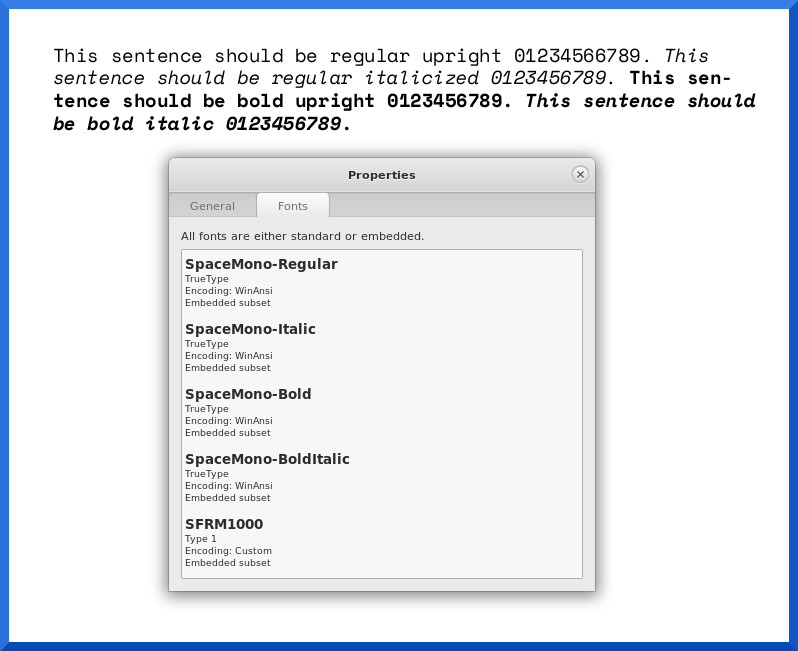

Space Mono LaTeX Files
======================

[Space Mono](https://fonts.google.com/specimen/Space+Mono) is a monospace font
available in both "normal" (400) and "bold" (700) weights with both an upright
and italic variant for those weights. All variants of the font have a dotted
zero.

From the Google Fonts Page (retrieved 2021-05-08):

> Space Mono is an original fixed-width type family designed by Colophon
> Foundry for Google Design. It supports a Latin Extended glyph set, enabling
> typesetting for English and other Western European languages.
> 
> Developed for editorial use in headline and display typography, the
> letterforms infuse a geometric foundation and grotesque details with
> qualities often found in headline typefaces of the 1960s (See: Microgramma,
> Eurostile), many of which have since been co-opted by science fiction films,
> television, and literature.

See: [Google Fonts: About Space Mono](https://fonts.google.com/specimen/Space+Mono#about)

Modifications for LaTeX
-----------------------

As distributed from Google Fonts, the font files will not work with `pdflatex`
because they have the `OS/2 Version` set to `4` which the `pdftex` engine used
by `pdflatex` does not like.

To remedy this situation, the fonts were downloaded on 2021-05-06 and modified
in [FontForge](https://fontforge.org/). Two modifications were made:

1. The `Really use typo metrics` option was unchecked (that option causes
   FontForge to always use `OS/2 Version 4` when generating TrueType fonts).
2. The `OS/2 Version` was changed from `4` to `3`.

No other changes to Space Mono were made in FontForge.

The resulting `.sfd` files are located within the following directory:

    texmf-tree/source/spacemono/

The resulting `.ttf` files are located within the following directory:

    texmf-tree/fonts/truetype/googlefonts/spacemono/

Both the `.sfd` and `.ttf` files fall under the SIL Open Font License (OFL)
version 1.1 as packaged in the original font download.

A copy of that file accompanies both the `.sfd` and `.ttf` files.

### Typo Metrics Note

It appears that sometime early in the 21st century, some Microsoft software
started ignoring ascenders and decenders in the font itself, using Microsoft's
own `winAscent` and `winDescent` under certain conditions.

It appears that the `typo metrics` options instructs that software not to do
that but instead follow the instructions in the font as the font designer
intended.

As such you may not want to install the TTF fonts in this git on a Windows
system for use outside of LaTeX---instead just use Google Fonts download as
system fonts on a Windows system---assuming you *want* Space Mono as a system
font.

The same issue *may* exist with Microsoft software running on macOS---using the
Google Fonts version *may* be better on macOS too if using as a system font and
you use some Microsoft software. I do not know.

On GNU/Linux systems as far as I know the option is meaningless. There should
be no difference between how the TTF fonts here render versus the Google Fonts
versions in any software on a GNU/Linux system. Also for non-Microsoft software
on macOS and Windows I suspect the option is meaningless.

Leave it to a behemoth capitalist company to change how a font behaves in such
a way that for font designers to get the original behavior, they have to select
a new option that requires changing other meta-data that then causes the font
not to work with some software. Capitalist idiots.

In fairness I could be wrong about what the `typo metrics` option does. That
option does seem to require that `OS/2 Version 4` be specified---which is why
FontForge will automatically set that version when exporting to `.ttf` if that
option is checked---and it does seem related to Microsoft rendering engines.

### ePub Note

Apparently some versions of Adobe Digital Edition also choke with `OS/2 Version
4` so if you want to embed this font in an ePub---you probably should embed the
TTF versions I have here rather than from Google Fonts. Otherwise it might work
just fine for you but not work at all for someone else with a different ePub
viewer that uses an older version of ADE.

Metric Files
------------

The Adobe Font Metric files were generated using the `ttf2afm` program using
the following option flag:

    -e T1-WGL4.enc

The resulting `.afm` files are located within the following directory:

    texmf-tree/fonts/afm/googlefonts/spacemono/

The TeX Font Metric files were generated using the `afm2tfm` program using the
following option flag:

    -T T1-WGL4.enc

The resulting `.tfm` files are located within the following directory:

    texmf-tree/fonts/afm/googlefonts/spacemono/

It is my understanding that in most countries, font metric files are not subject
to copyright and therefore not subject to the font license. However, if that is
not the case in your country, the Adobe Font Metric files and the TeX Font
Metric files would fall under the same SIL OFL that the Space Mono font files
falls under.

Map File
--------

A single font map file for the `pdftex` engine is provided at:

    texmf-tree/fonts/map/pdftex/googlefonts/spacemono.map

I do not know if other font map files for other engines are needed. If you are
packaging this font for CTAN or you wish to use this font with a different
LaTeX engine, please consult a LaTeX guru if you---like me---also do not know.

I believe that some LaTeX engines (like `dvips`) do not work with TrueType
fonts. If interested in packaging this font for use with `dvips` you *probably*
have to convert it to a Type 1 font first.

I recommend against doing so unless you *really* know what you are doing and
there *really* is a genuine need.

I consider the map file too generic to be subject to copyright but if a license
must be applied to it---then Creative Commons CC0 would apply. That license is
equivalent to Public Domain.

Style File
----------

A single style file is located at:

    texmf-tree/tex/latex/spacemono/spacemono.sty

This style file does not involve any novel or non-obvious code. I release it
under the terms of the Creative Commons CC0 license. That license is equivalent
to public domain.

Font Driver Files
-----------------

Font driver files for three TeX Encodings are provided:

1. `texmf-tree/tex/latex/spacemono/t1spacemono.fd`
2. `texmf-tree/tex/latex/spacemono/ot1spacemono.fd`
3. `texmf-tree/tex/latex/spacemono/t3spacemono.fd`

The T1 Encoding is the encoding intended to be used with this font. The OT1
driver file exists purely for compatibility with old LaTeX projects that still
use that old encoding.

The T1 and OT1 driver files do not involve any novel or non-obvious code. I
release them under the terms of the Creative Commons CC0 license. That license
is equivalent to public domain.

The T3 Encoding provides compatibility when using the
[tipa](https://ctan.org/pkg/tipa) package to typeset International Phonetic
Alphabet characters.

If you are using tipa *and* you have Space Mono set as the default monospace
font *and* you want the IPA characters typeset using the tipa monospace font,
then the T3 font driver for Space Mono is needed or you will end up with
problems.

Space Mono itself does not provide the glyphs for the T3 encoding, what happens
is the driver file tells LaTeX2e to use the tipa font files when a T3 encoding
is active and Space Mono is the defined typewriter (monospace) font.

If in the future the necessary glyphs are added to Space Mono then the driver
file could be updated to use Space Mono for IPA instead of using the tipa
provided font but I have no plans on doing that, and I do not think the
original font developers have such plans either.

The T3 driver file was copied from `t3cmtt.fd` in the tipa package and modified
for Space Mono. It is licensed under the LPPL 1.2 license.

Install
-------

These instructions are for TeXLive 2021 but should work on older and newer
versions and should work in *most* LaTeX distributions (MiKTeX, MacTeX, PCTeX,
et cetera) but I have not tried.

Find your `TEXMF-LOCAL` tree. Consult your LaTeX documentation. On my system
where TeXLive is installed within `/usr/local/texlive` the directory for my
`TEXMF-LOCAL` is

    /usr/local/texlive/texmf-local

If your TeXLive is packaged by a GNU/Linux distribution, ask in your distro
support forum if you do not know where it is.

Make sure you are a user account with permission to modify your LaTeX install.

Within your `TEXMF-LOCAL` tree install the files from the `texmf-tree`
directory in this git using the same directory hierarchy. You do not need the
`texmf-tree/source/` files and you *probably* do not need the
`texmf-fonts/afm/` files. However it does not hurt for both to be installed and
they could be useful down the road.

After the files are in place, then run the following commands:

    mktexlsr && updmap-sys --enable Map=spacemono.map

Congratulations, the Space Mono font is now available to your `pdftex` engine
(e.g. by using `pdflatex`).

Test Document
-------------

Create a file with the following content and call it `spacemonotest.tex`:

    \documentclass{article}
    \usepackage{spacemono}
    \usepackage[utf8]{inputenc}
    \begin{document}
    \noindent\texttt{% //start of monospace
    This sentence should be regular upright 01234566789.
    \emph{% //start of italic
    This sentence should be regular italicized 0123456789.
    }%
    \textbf{% //start of bold
    This sentence should be bold upright 0123456789.
    \emph{% //start of bold italic
    This sentence should be bold italic 0123456789.
    }% //end of bold italic
    }% //end of bold
    }% //end of monospace
    \end{document}

Compile the document with the following command:

    pdflatex spacemonotest.tex

The resulting `spacemonotest.pdf` file should be one page and show all four of
the variations of the font. Viewing the properties of the PDF should show all
four variants embedded.

Using Space Mono
----------------

In your LaTeX document preamble *after* your class declaration and *after* you
you declare the font used for your main text---assuming you do so---add the
following line of code:

    \usepackage{spacemono}

Space Mono will now be the default monospace font used wherever your LaTeX code
calls for a monospace font (e.g. the `\url{}` command, the `\texttt{}` command,
`verbatim` environments, et cetera).

### Size Issue

It is my opinion that this font renders too tall compared to the body font, at
least when `\usepackage{times}` is used to set Adobe Times (or the URW
equivalent Nimbus Roman No9 L) as the body font. Note that it is my opinion
that the Adobe Courier font (or the URW equivalent Nimbus Mono L) that is set
as the default typewriter font by `times.sty` is also too tall.

To reduce the height of Space Mono relative to the body font, add the following
to your preamble:

    \usepackage{letltxmacro}
    \LetLtxMacro\oldttfamily\ttfamily
    \DeclareRobustCommand{\ttfamily}{\oldttfamily\csname ttsize\endcsname}
    \newcommand{\setttsize}[1]{\def\ttsize{#1}}%

Then after `\begin{document}` add the following line:

    \setttsize{\small}

Freeverse Software, problem solved.

CTAN Packagers
--------------

Someone from the TeX/LaTeX community who has the ability to maintain packages
in [CTAN](https://ctan.org/) please clone this git, make whatever changes you
need/want to make, and submit this font to CTAN so that it is readily and
easily available.

I do not have ability to maintain squat on CTAN. However, it appears that CTAN
lacks a good selection of modern monospace (typewriter) fonts.

If you package stuff for CTAN the anymouse prophet *begs* you to package this
font there so it can be used by others without needing to manually install the
fonts.

I just am not in a position to maintain packages there myself.

Colophon Foundry
----------------

The Colophon Foundry has some beautiful commercial fonts. Those who have a need
for fonts (inside or outside of LaTeX) should definitely check out their
commercial offerings:

https://www.colophon-foundry.org/typefaces/

The Anymouse Prophet has no relationship with the Colophon Foundry or any of
its employees. This plug was not paid for. I just really admire their work.

